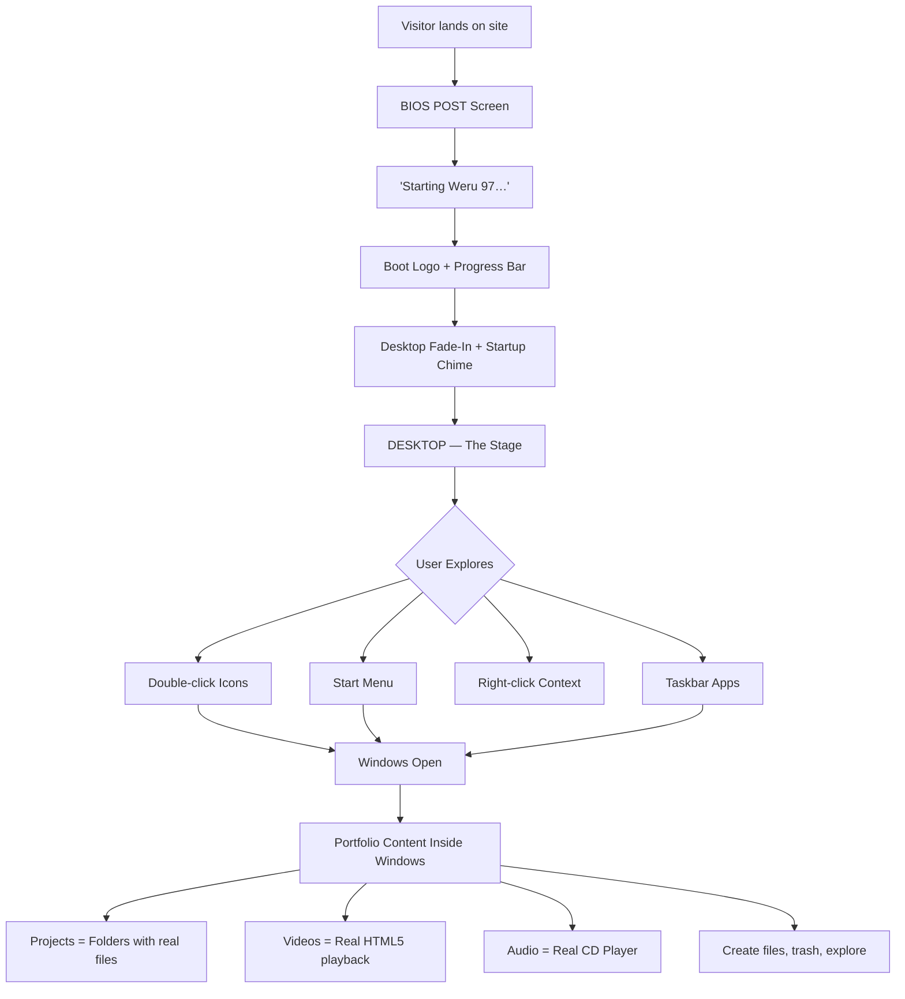
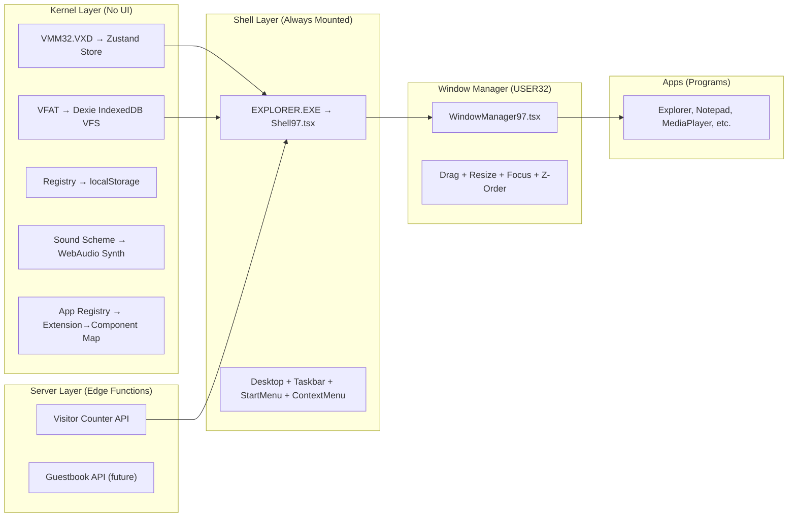

# Weru 97 — Complete Architecture, Flow & Functionality Blueprint (v2)

## Visual Fidelity Execution Addendum — 2026-09-21

The current completion work includes a dedicated visual-fidelity pass based on the local Stitch HTML and the supplied Windows 97 pixel-art reference. The active execution checklist is `plans/weru97-chapter-2-task-list.md`; the earlier `plans/weru97-visual-fidelity-task-list.md` is retained as historical planning context.

The 1024×768 source composition is used only to reproduce Stitch-authored window/icon anchor positions; it is not the runtime viewport or a centered desktop frame. The production shell and taskbar fill the browser, while saved and new window rectangles are clamped to the current visible work area. Local pixel assets, the Bliss wallpaper, classic styling, and shared pointer controls are implemented. Raw Stitch HTML remains reference material and is not rendered through an iframe.

Execution order: baseline and source audit, pixel assets, canonical canvas, wallpaper, desktop icons, taskbar, window interaction, window chrome, boot screen, application extraction, cursor polish, CSS cleanup, automated verification, manual visual QA, and history updates.

### Current execution checkpoint

The asset and shell convergence slice is verified. The local asset manifest now covers all required icon/cursor categories and the boot/app buckets. The classic Start menu follows the Stitch 210px vertical-banner composition. Paint, Calculator, Minesweeper, Media Player, and Internet Explorer use shared Win97 chrome and Stitch-derived visual treatments while retaining real interactions. The active global stylesheet no longer imports the inactive modern taskbar, token, or Spotlight surfaces. Remaining work is explicitly tracked as partial in the active Chapter 2 checklist: exact per-source screenshot parity, full multi-window/touch evidence, missing independent source artifacts, and real media playback assets.

> **This is NOT a code plan yet.** This is the creative and technical brain behind Weru 97 — every flow, every click, every sound, every easter egg. You (Roy) handle the UI/UX design on Stitch. I handle the logic, the architecture, and the soul.

---

## 1. The Big Picture: What Is Weru 97?

Weru 97 is your portfolio disguised as a fully functional 1997 desktop operating system. It's not "retro-themed" — it **is** the OS. Visitors don't browse your portfolio; they **use your computer**. Every project is a file. Every skill is system hardware. Every interaction follows the rules of Windows 95 OSR 2.5 (the real "Windows 97").



---

## 2. Current State vs. Target State

### What exists now (Windows 11 Fluent — already migrated FROM macOS)

The codebase has **already completed** a migration from macOS to Windows 11. The active runtime is fully Windows 11 Fluent:

| Layer | Current (Win11) | What Needs to Change for Win97 |
|-------|-----------------|-------------------------------|
| **Shell** | Centered bottom taskbar (`Taskbar.tsx`), Windows 11 Start Menu (`StartMenu.tsx`), Quick Settings flyout (`QuickSettings.tsx`) | → Left-aligned Start button, classic cascading Start Menu, no Quick Settings |
| **Window Chrome** | Rounded 6px corners, Fluent `×`/`−`/`□` controls, acrylic materials, 8-zone Aero Snap (`snap-engine.ts`) | → Square corners, 2px bevels, `[_][□][X]` buttons, blue gradient title bar, no snap layouts |
| **Boot** | Windows 11 staged: lock screen (4-square logo + clock) → user card → spinning ring "Welcome" | → BIOS POST → "Starting Weru 97…" → clouds logo → desktop |
| **Desktop** | Draggable shortcuts on Bloom-gradient wallpaper, Win11 context menu | → Bliss wallpaper, left-column icons, Win95 context menu, CRT scanlines |
| **Typography** | `Segoe UI Variable` / `Segoe UI` | → Tahoma 8px for UI, Courier New for Notepad, VT323 for terminal |
| **Filesystem** | `C:\Users\Admin\Desktop\...` via **Dexie IndexedDB**. Full CRUD, recycle bin, search | → Flatten to `C:\My Documents`, `C:\Projects`, `C:\Recycled`. **Keep the IndexedDB engine — it's solid** |
| **State** | Zustand `os-store.ts` persisted to localStorage | → Same engine, retune for Win95 modes |
| **Apps** | Explorer, Notepad, Media Player, Terminal (tabbed!), Settings, Recycle Bin, Projects, About, Contact, Photos | → Restyle as Win95 apps. Add: Calculator, Minesweeper, CD Player, Paint, IE4, MS-DOS Prompt, Control Panel |

### Dormant macOS Remnants (to be deleted)
- [Dock.tsx](file:///c:/Users/Admin/OneDrive/Desktop/weru_os/src/components/Dock.tsx) + [dock.css](file:///c:/Users/Admin/OneDrive/Desktop/weru_os/src/styles/dock.css)
- [MenuBar.tsx](file:///c:/Users/Admin/OneDrive/Desktop/weru_os/src/components/MenuBar.tsx) + [menubar.css](file:///c:/Users/Admin/OneDrive/Desktop/weru_os/src/styles/menubar.css)
- [Spotlight/](file:///c:/Users/Admin/OneDrive/Desktop/weru_os/src/components/Spotlight) + [useSpotlight.ts](file:///c:/Users/Admin/OneDrive/Desktop/weru_os/src/hooks/useSpotlight.ts)
- [Sidebar/index.tsx](file:///c:/Users/Admin/OneDrive/Desktop/weru_os/src/components/Sidebar) — macOS Finder sidebar
- [useParallax.ts](file:///c:/Users/Admin/OneDrive/Desktop/weru_os/src/hooks/useParallax.ts)
- Legacy macOS strings in [constants/index.ts](file:///c:/Users/Admin/OneDrive/Desktop/weru_os/src/constants/index.ts)
- [template.txt](file:///c:/Users/Admin/OneDrive/Desktop/weru_os/template.txt), [context.txt](file:///c:/Users/Admin/OneDrive/Desktop/weru_os/context.txt)

### What to KEEP (adapt, don't rewrite)
1. **Zustand [os-store.ts](file:///c:/Users/Admin/OneDrive/Desktop/weru_os/src/features/os/os-store.ts)** — simplify for Win95
2. **Dexie IndexedDB VFS** — [filesystem-service.ts](file:///c:/Users/Admin/OneDrive/Desktop/weru_os/src/features/filesystem/filesystem-service.ts). Re-seed with Win95 tree
3. **[open-target.ts](file:///c:/Users/Admin/OneDrive/Desktop/weru_os/src/features/os/open-target.ts)** — add Win95 extensions
4. **[app-registry.ts](file:///c:/Users/Admin/OneDrive/Desktop/weru_os/src/features/apps/app-registry.ts)** — expand with new apps
5. **[terminal-commands.ts](file:///c:/Users/Admin/OneDrive/Desktop/weru_os/src/features/terminal/terminal-commands.ts)** — restyle as MS-DOS Prompt
6. **Window drag/resize logic** in [Window.tsx](file:///c:/Users/Admin/OneDrive/Desktop/weru_os/src/components/Window.tsx) — strip snap, restyle chrome
7. **[ExplorerContent.tsx](file:///c:/Users/Admin/OneDrive/Desktop/weru_os/src/windows/ExplorerContent.tsx)**, **[NotepadContent.tsx](file:///c:/Users/Admin/OneDrive/Desktop/weru_os/src/windows/NotepadContent.tsx)**, **[RecycleBinContent.tsx](file:///c:/Users/Admin/OneDrive/Desktop/weru_os/src/windows/RecycleBinContent.tsx)** — restyle
8. **[profile-storage.ts](file:///c:/Users/Admin/OneDrive/Desktop/weru_os/src/features/os/profile-storage.ts)** — per-visitor isolation. Keep as-is!

> [!IMPORTANT]
> **The core insight:** Explorer.exe in Win95 = ONE program. Our `<Shell97/>` must feel like one living organism.

---

## 3. Architecture: The OS as a Web App

### 3.1 Layer Map



### 3.2 File Structure

```
src/
├── os/                          ← the "kernel + drivers" (no UI)
│   ├── kernel/
│   │   ├── store.ts             ← zustand: windows, focus, zOrder, processes
│   │   ├── actions.ts           ← openWindow, closeWindow, focusWindow, minimize
│   │   └── types.ts             ← Weru97Window, AppId, ProcessState
│   ├── fs/
│   │   ├── filesystem.ts        ← Dexie IndexedDB VFS (adapted from current)
│   │   ├── paths.ts             ← resolve("C:\\Projects\\3D-Website")
│   │   └── content/
│   │       ├── projects/        ← one ts file per project
│   │       ├── documents/       ← about_me.txt, cv, skills.txt
│   │       └── media/           ← video/audio manifests
│   ├── registry/
│   │   └── settings.ts          ← wallpaper, sound, positions (localStorage)
│   ├── sound/
│   │   └── synth.ts             ← WebAudio synthesis + HTML5 Audio for real tracks
│   ├── visitors/
│   │   └── counter.ts           ← Visitor counter API client
│   └── apps/
│       └── registry.ts          ← .txt→Notepad, .avi→MediaPlayer, .bmp→Paint
│
├── shell/                       ← EXPLORER.EXE — never unmounts
│   ├── Shell97.tsx
│   ├── Desktop97.tsx
│   ├── Taskbar97.tsx
│   ├── StartMenu97.tsx
│   └── ContextMenu97.tsx
│
├── wm/                          ← the window manager
│   ├── Window97.tsx
│   ├── WindowManager97.tsx
│   ├── useDrag97.ts
│   └── useResize97.ts
│
├── components/                  ← COMCTL32 (Win95 UI kit)
│   ├── Button95.tsx, TitleBar95.tsx, MenuBar95.tsx, Dialog95.tsx
│   ├── Scrollbar95.tsx, Icon32.tsx, TaskbarButton.tsx, Toolbar95.tsx
│   └── Clock95.tsx, Tray95.tsx
│
├── apps/
│   ├── explorer/Explorer97.tsx
│   ├── notepad/Notepad97.tsx
│   ├── mediaPlayer/MediaPlayer97.tsx     ← REAL video playback
│   ├── cdPlayer/CdPlayer97.tsx           ← REAL audio playback
│   ├── paint/Paint97.tsx
│   ├── calc/Calculator97.tsx
│   ├── ie4/RetroBrowser97.tsx
│   ├── msDosPrompt/MsDosPrompt97.tsx
│   ├── games/
│   │   └── minesweeper/Minesweeper97.tsx ← visual + few moves only
│   └── system/
│       ├── SystemProperties97.tsx
│       ├── ControlPanel97.tsx
│       ├── ShutDown97.tsx
│       ├── RunDialog97.tsx
│       ├── FindFiles97.tsx
│       └── WelcomeWizard97.tsx
│
├── boot/
│   ├── BootSequence97.tsx
│   └── Screensaver97.tsx                 ← Starfield after idle
│
├── api/                                  ← Next.js API routes (Edge)
│   └── visitors/
│       └── route.ts                      ← GET/POST visitor counter
│
├── assets/
│   ├── icons/
│   ├── cursors/
│   ├── wallpaper/
│   └── sounds/
│
├── styles/
│   ├── tokens97.css, bevels.css, fonts97.css, crt.css
│
└── App.tsx                               ← BootSequence → Shell97
```

---

## 4. The Boot Sequence — First Impressions

### Scene 1 — BIOS POST (2s)
```
Phoenix BIOS v4.06 R2.P21, An Energy Star Ally
Copyright 1985-1997 Phoenix Technologies Ltd.

Pentium II Processor 233 MHz
Memory Test: 65536K OK

Detecting IDE drives...
  Primary Master:   WERU-PORTFOLIO HDD
  Primary Slave:    None
  Secondary Master: WERU CD-ROM 52X

Verifying DMI Pool Data.............
```
Text typewriter at 80ms/line. Memory counter rolls up.

### Scene 2 — "Starting Weru 97…" (1.5s)
White Tahoma text, centered bottom, black screen.

### Scene 3 — Boot Logo (2.5s)
Clouds sky, Weru 97 flag logo, segmented blue progress bar (10 segments × 250ms). **Asset preloading happens here.**

### Scene 4 — Desktop Fade-In (1.5s)
Wallpaper → taskbar slides up → icons pop in staggered → startup chime. "Skip >>" bottom-right.

### Scene 5 — Welcome Wizard (first visit only)
> [!TIP]
> **New creative flow!** First-time visitors get a "Welcome to Weru 97" wizard dialog (like the real Win95 Welcome):
> - Page 1: "Welcome to Weru 97! Click Next to explore Roy's portfolio."
> - Page 2: "Double-click any icon to open it. Right-click for more options."
> - Page 3: "Start exploring! Try the Projects folder first."
> - Checkbox: "☐ Show this wizard next time you start Weru 97"
> - Stored in localStorage, dismissed forever if unchecked.

---

## 5. The Desktop — Home Page

### 5.1 Wallpaper & CRT Effect
Bliss wallpaper + CRT scanline overlay (3% opacity) + slight pixelation via `image-rendering: pixelated`.

### 5.2 Desktop Icons (Left Column)

| # | Icon | Label | Double-Click Action |
|---|------|-------|---------------------|
| 1 | CRT monitor | **My Computer** | Explorer at `C:\` |
| 2 | Yellow folder | **My Documents** | Explorer at `C:\My Documents` |
| 3 | Open folder | **Projects** | Explorer at `C:\Projects` (first-time: playful warning dialog) |
| 4 | Folder + filmstrip | **Videos** | Explorer at `C:\My Documents\Videos` |
| 5 | Folder + music note | **My Music** | CD Player |
| 6 | Folder + image | **My Pictures** | Paint/Image viewer |
| 7 | Blue "e" orbit | **Internet Explorer** | Retro Browser |
| 8 | Folder + joystick | **Games** | Explorer at `C:\Program Files\Games` |
| 9 | *(gap)* | | |
| 10 | Recycle bin | **Recycle Bin** | Recycle Bin window |

### 5.3 Icon Interactions
- **Hover**: brightness(1.1)
- **Single click**: Dotted focus rect, navy fill, white text
- **Double click**: Window opens
- **Drag**: Grid-snapped repositioning
- **Rubber-band select**: Dotted selection rectangle on desktop drag

### 5.4 The Taskbar (bottom, ~30px, `#C0C0C0`)
```
[🪟 Start] | [📂][📝][▶][🌐] | [My Documents] [Notepad] | [🔊 📺 8:52 PM]
```
- **Start**: Raised bevel, 4-color flag + bold "Start". Pressed = sunken.
- **Quick Launch**: Explorer, Notepad, Media Player, IE. Single click opens.
- **Task Buttons**: One per open window. Focused = sunken. Click = focus or minimize-if-already-focused.
- **System Tray**: Speaker (toggle sound), monitor (res tooltip), clock (real time, click for calendar popup). **Visitor counter**: tiny "Visitors: 1337" tooltip on monitor icon hover.

---

## 6. The Start Menu

Classic Win95 two-column cascading menu.

### Programs ▸
```
├── Windows Explorer          → Explorer at C:\
├── Notepad                   → Notepad (blank)
├── Paint                     → Paint
├── Media Player              → Media Player
├── CD Player                 → CD Player
├── Calculator                → Calculator
├── Internet Explorer         → Retro Browser
├── MS-DOS Prompt             → DOS Prompt
├── ─────────────
└── Games ▸
    ├── Minesweeper
    └── Solitaire (visual only)
```

### Documents ▸
```
├── about_me.txt         → Notepad
├── skills.txt           → Notepad
├── experience.txt       → Notepad
├── cv.pdf               → IE viewer
└── project-demo.avi     → Media Player
```

### Settings ▸ → Control Panel / Taskbar settings
### Find ▸ → Find Files dialog (searches the IndexedDB VFS!)
### Run… → Run dialog (type `notepad`, `calc`, `explorer C:\Projects`)
### Help → About Weru 97 dialog
### Shut Down… → Shut Down dialog

---

## 7. The Window Manager

### Window Chrome
- Title bar: `#000080 → #1084D0` active, `#808080` inactive
- Buttons: `[_][□][X]` — 16px, beveled
- Bevel: outer `#DFDFDF` → `#808080`, inner `#FFFFFF` / `#404040`
- **Square corners always.** Zero border-radius.

### Z-Order Rules
1. Focused = top. 2. Close = focus next. 3. Minimize = leave stack. 4. Restore = top. 5. Dialogs = modal, above all.

### Title Bar Context Menu (right-click title bar)
Restore, Move, Size, Minimize, Maximize, ─, Close

### Taskbar Context Menu (right-click empty area)
Cascade, Tile Horizontally, Tile Vertically, ─, Minimize All, ─, Properties

---

## 8. The Virtual Filesystem — Everything Is a File

### 8.1 Directory Tree (Win95-style, flattened)

```
C:\
├── My Documents\
│   ├── about_me.txt           ← personal bio + skills overview
│   ├── skills.txt             ← full categorized skill list
│   ├── experience.txt         ← work history timeline
│   ├── cv.pdf                 ← resume
│   └── Videos\
│       ├── demo-reel.avi
│       └── project-walkthrough.avi
│
├── Projects\                   ← THE portfolio core (5 projects)
│   ├── AfyaTrack\
│   │   ├── README.txt         ← project description + summary
│   │   ├── skills-used.txt    ← "React, Next.js, TailwindCSS, AI"
│   │   ├── tech-stack.spec    ← opens System Properties-style dialog
│   │   ├── demo.avi           ← REAL video demo
│   │   ├── screenshots.bmp    ← opens in Paint viewer
│   │   └── live-site.url      ← opens in IE (link to deployed site)
│   │
│   ├── Kontent-Pyper\
│   │   ├── README.txt
│   │   ├── skills-used.txt
│   │   ├── tech-stack.spec
│   │   ├── demo.avi           ← may or may not have video
│   │   ├── screenshots.bmp
│   │   └── source-code.url
│   │
│   ├── eStore-Redesign\
│   │   └── (same flexible structure — include what's available)
│   │
│   ├── Leos-Spa-Booking\
│   │   └── (same structure)
│   │
│   └── Adventures-App\
│       └── (same structure)
│
├── Program Files\
│   ├── Accessories\
│   │   ├── notepad.exe, calc.exe, mplayer.exe, pbrush.exe, cdplayer.exe
│   ├── Internet Explorer\
│   │   └── iexplore.exe
│   └── Games\
│       ├── winmine.exe
│       └── sol.exe
│
├── Windows\
│   ├── System\
│   │   └── secrets.txt        ← EASTER EGG
│   ├── Media\
│   │   ├── tada.wav, chord.wav, ding.wav, The Weru Sound.wav
│   └── Start Menu\
│       └── Programs\
│
├── Recycled\                   ← Recycle Bin (functional via Dexie!)
│
├── IO.SYS, MSDOS.SYS, COMMAND.COM  ← hidden system flavor files
│
└── GUESTBOOK.TXT              ← visitor signatures (future server-sync)
```

### 8.2 Project Folder Philosophy

> [!IMPORTANT]
> **Each project is a folder, not a card.** A project is explored exactly like a real directory — by opening files inside it.

The structure is **flexible per project**. Not every project needs every file:

| File | Required? | What It Contains |
|------|-----------|-----------------|
| `README.txt` | ✅ Always | Project name, summary paragraph, 3 key features, what it does |
| `skills-used.txt` | ✅ Always | Bullet list of technologies/skills used |
| `tech-stack.spec` | ✅ Always | Opens a tabbed dialog showing stack details |
| `demo.avi` | ❓ If available | REAL video demo (HTML5 `<video>`) |
| `screenshots.bmp` | ❓ If available | Project screenshot(s) opened in Paint viewer |
| `live-site.url` | ❓ If available | Opens in IE — links to deployed site |
| `source-code.url` | ❓ If available | Opens in IE — links to GitHub repo |
| `audio-demo.wav` | ❓ If available | Opens in CD Player |

### 8.3 File Extension → App Mapping

| Extension | App | Icon |
|-----------|-----|------|
| `.txt` | Notepad97 | 📝 |
| `.avi` / `.mp4` / `.webm` | MediaPlayer97 | 🎬 |
| `.wav` / `.mp3` / `.mid` | CdPlayer97 | 🎵 |
| `.bmp` / `.jpg` / `.png` | Paint97 | 🖼️ |
| `.url` | RetroBrowser97 | 🌐 |
| `.spec` | SystemProperties97 | 📋 |
| `.exe` | Launches app | ⚙️ |

### 8.4 Per-Visitor Sandbox

> [!TIP]
> **This is already built.** The current [profile-storage.ts](file:///c:/Users/Admin/OneDrive/Desktop/weru_os/src/features/os/profile-storage.ts) generates a UUID per browser. The Dexie database is namespaced as `weru-os-filesystem-${profileId}`. This means:
>
> - Each visitor gets their **own filesystem copy** in their browser's IndexedDB
> - They can create text files (already supported: `createTextFileNode`)
> - They can delete files to Recycle Bin (already supported: `deleteNodeToTrash`)
> - They can restore from Recycle Bin (already supported: `restoreTrashEntry`)
> - They can rename files (already supported: `renameNode`)
> - If they close the browser and come back, **everything they did persists**
>
> We don't need to build this — we just need to **expose it** through the Win95 UI (context menus, dialogs, Notepad save).

---

## 9. App Specifications

### 9.1 Media Player (mplayer.exe) — REAL VIDEO PLAYBACK

> [!IMPORTANT]
> **This is a real video player**, not a mock. It wraps HTML5 `<video>` inside Win95 Media Player 6.4 chrome.

**Architecture:**
```
┌─ demo.avi - Media Player ──────────────────[_][□][X]─┐
├─ File  Edit  View  Help ──────────────────────────────┤
│ ┌─────────────────────────────────────────────────┐   │
│ │                                                 │   │
│ │         <video> element (4:3, dark bg)          │   │
│ │         styled with CRT scanlines overlay       │   │
│ │                                                 │   │
│ └─────────────────────────────────────────────────┘   │
│  [▶] [■] [❚❚]    ═══════●══════════    00:24 / 00:45 │
│                    ↑ custom seek bar                   │
│  🔊 ══●═══                                            │
│   ↑ volume slider                                     │
├───────────────────────────────────────────────────────┤
│  Playlist:                                            │
│  ▸ demo.avi (playing)                                 │
│    homepage-loop.mp4                                  │
│    mobile-preview.webm                                │
└───────────────────────────────────────────────────────┘
```

**How it works:**
1. A hidden `<video>` element is the actual player
2. Custom Win95 transport controls (Play/Stop/Pause) call `video.play()`, `video.pause()`, etc.
3. Custom seek slider binds to `video.currentTime` / `video.duration`
4. Custom volume slider binds to `video.volume`
5. Time LCD reads from `video.currentTime` → formatted as `MM:SS`
6. VHS/CRT scanline overlay on the video surface via CSS pseudo-element
7. Videos served from `/public/media/videos/` (self-hosted) or from your Vercel/CDN

**Video sources:** You'll give me the actual video files or YouTube URLs. If YouTube, I'll use a poster frame + link-to-open approach. If self-hosted, pure HTML5.

### 9.2 CD Player (cdplayer.exe) — REAL AUDIO PLAYBACK

**Architecture:**
1. Hidden `<audio>` element plays the track
2. Custom LCD display shows track time (seven-segment style digits)
3. Transport buttons: |◀ ▶ ■ ❚❚ ▶| ⏏
4. **Live equalizer visualization** using Web Audio API:
   - Connect `<audio>` to `AudioContext` → `AnalyserNode`
   - `getByteFrequencyData()` at 30fps
   - Render 7 green bars of varying heights — the classic equalizer
5. Playlist dropdown lists audio tracks
6. Now Playing mini-window with scrolling track name

**Audio sources:** You'll provide URLs to audio files (MP3/WAV on CDN, Spotify embeds, or SoundCloud). I recommend self-hosting 3–5 short tracks on `/public/media/audio/`.

### 9.3 File Explorer (explorer.exe)
Same as before but with enhanced project folder experience:
- Double-click a project folder → navigate inside, see README.txt, demo.avi, etc.
- Status bar shows: "6 object(s) (14.9 MB)"
- Right pane in Details view: Name | Size | Type | Date Modified
- Back/Forward/Up history navigation
- **New**: Right-click > New > Text Document — visitor creates a file!

### 9.4 Notepad (notepad.exe)
- Visitors can **edit and save** text files they create
- Portfolio content files (about_me.txt, skills.txt, README.txt) are **read-only** (shown with lock icon)
- Ctrl+S saves visitor-created files to IndexedDB
- File > Save As... creates new files
- **All using the existing Dexie VFS — no new backend needed**

### 9.5 Internet Explorer 4 (iexplore.exe)
Opens `.url` files. Content area renders either:
- A **1997-style links page** for the contact/links URL
- An **iframe** to the actual live site for project case-study URLs (with a "Loading..." progress bar)
- Visitor counter at the bottom: "You are visitor number 0001337" (REAL count from server)

### 9.6 Calculator (calc.exe)
Fully functional. All math works. Small fixed window.

### 9.7 Minesweeper (winmine.exe)
Visual + a few moves only. Pre-set board state showing:
- Some revealed numbers (1=blue, 2=green, 3=red)
- One flag placed
- Clicking a square reveals it (from a pre-determined safe set)
- Smiley face button resets to initial state
- **Not a full game engine** — just enough to delight

### 9.8 MS-DOS Prompt
Existing terminal commands restyled:
```
C:\> help
C:\> dir
C:\> cd Projects\AfyaTrack
C:\Projects\AfyaTrack> type README.txt
C:\> projects
C:\> skills
C:\> contact
C:\> matrix        ← easter egg
C:\> whoami
```

### 9.9 System Properties (About Me)
Tabs: General | Hardware | Performance
- **General**: Name, bio, "Pentium II 233 MHz, 64 MB RAM"
- **Hardware**: Skills as "device drivers" — React.js Driver v19, Python Engine v3.12
- **Performance**: Animated progress bars for skill categories

### 9.10 Control Panel
Icon grid: Display Properties, Sounds, System, Add/Remove Programs (easter egg)

### 9.11 Run Dialog (Start > Run…)

> [!TIP]
> **New creative flow!** Type program names to launch them:
> - `notepad` → opens Notepad
> - `calc` → opens Calculator
> - `explorer` → opens Explorer at C:\
> - `explorer C:\Projects` → opens Explorer at that path
> - `winmine` → opens Minesweeper
> - `iexplore` → opens IE
> - `regedit` → "Access denied. Nice try. 😏"

### 9.12 Find Files (Start > Find > Files or Folders…)

> [!TIP]
> **New creative flow!** A search dialog that queries the IndexedDB VFS using the existing `searchNodes()` function. Type "react" → finds skills.txt, README files mentioning React, etc.

### 9.13 Shut Down
- **Shut down**: Fade to black → "It's now safe to turn off your computer" (orange text on black, authentic Win95) → "Click anywhere to restart" small text
- **Restart**: Page reload with full boot sequence
- **Cancel**: Back to desktop

---

## 10. Screensaver — Starfield

> [!TIP]
> **New creative flow!** After **2 minutes of no mouse/keyboard activity**, the classic Starfield screensaver activates:
> - Stars (white dots) fly toward the viewer from the center of the screen
> - Canvas-based animation, ~200 stars, increasing speed over time
> - Any mouse movement or keypress instantly returns to the desktop
> - Configurable via Control Panel > Display > Screen Saver tab

**Why this matters:** It's the single most recognized Win95 screensaver. Anyone who used Windows in the 90s will involuntarily smile.

---

## 11. Blue Screen of Death — Easter Egg

> [!TIP]
> **New creative flow!** Triggered by one of these:
> - Typing `CTRL+ALT+DELETE` keyboard combo
> - Running `crash` in MS-DOS Prompt
> - Opening too many windows (>10)

```
Windows

An exception 0E has occurred at 0028:C004B0A3 in VxD WERU97(01)
+ 000010A3. This was called from 0028:C004AED5 in VxD
PORTFOLIO(03) + 0000AED5.

* Press any key to attempt to continue.
* Press CTRL+ALT+DEL to restart your computer. You will
  lose any unsaved information in all applications.

        Press any key to continue ____
```

Pressing any key: the BSOD disappears with a brief flicker, and the desktop returns perfectly fine. A dialog pops up: "Weru 97 has recovered from a serious error. Just kidding. 😄"

---

## 12. Visitor Tracking System

### 12.1 Global Visitor Counter

**Architecture:**
```
Visitor Browser                    Vercel Edge
    │                                  │
    ├─── GET /api/visitors ───────────►│
    │                                  ├── Increment KV counter
    │◄── { count: 1337, id: "..." } ──┤
    │                                  │
    └── Display in IE footer:          │
        "You are visitor #0001337"     │
```

- **Server**: Next.js API route (`src/app/api/visitors/route.ts`) using Vercel KV (Redis)
- **On first visit**: POST increments counter, returns visitor number + assigns visitor UUID
- **On return visit**: GET returns their stored number (cookie/localStorage mapping)
- **Display**: IE4 links page footer, System Properties "About" tab, `systeminfo` terminal command

### 12.2 Per-Visitor Persistence (Already Built!)

The current architecture already gives each visitor their own isolated sandbox:

| What | How | Storage |
|------|-----|---------|
| Filesystem (files, folders) | Dexie IndexedDB, namespaced by `weru-profile-id` | Browser-local |
| Window positions, settings | Zustand persist to localStorage | Browser-local |
| Recycle Bin contents | Dexie IndexedDB `trash` table | Browser-local |
| Terminal history | localStorage `weru-terminal-history-v1-...` | Browser-local |
| Desktop icon positions | Zustand `shortcuts` array | Browser-local |

**What visitors can do:**
- ✅ Create new text files (New > Text Document)
- ✅ Edit files in Notepad (Ctrl+S saves)
- ✅ Rename files (F2 or right-click > Rename)
- ✅ Delete files to Recycle Bin
- ✅ Restore files from Recycle Bin
- ✅ Empty Recycle Bin
- ✅ Rearrange desktop icons
- ✅ Change wallpaper and sound settings
- ✅ Come back days later — everything persists

### 12.3 Future: Server-Synced Guestbook

When you're ready to upgrade:
- `GUESTBOOK.TXT` at `C:\` — visitors can append a message
- Messages sync to a server (Vercel KV or Supabase) so ALL visitors see everyone's entries
- Like a 90s web guestbook, but inside the OS

---

## 13. Context Menus

### Desktop Right-Click
```
Arrange Icons ▸   (by Name | by Type | Auto Arrange)
Line Up Icons
─────────────
New ▸             (Folder | Text Document)
─────────────
Paste
Paste Shortcut    (grayed out)
─────────────
Refresh
─────────────
Properties        (opens Display Properties)
```

### File Right-Click (Explorer)
```
Open
Open With… ▸
─────────────
Cut
Copy
─────────────
Delete
Rename
─────────────
Properties
```

### Taskbar Right-Click
```
Cascade Windows
Tile Horizontally
Tile Vertically
─────────────
Minimize All
─────────────
Properties
```

---

## 14. Sound Scheme — WebAudio + HTML5 Audio

| Event | Sound | Method |
|-------|-------|--------|
| Boot complete | Startup chime (6s) | WebAudio oscillator chord |
| Window open | Chord (200ms) | WebAudio |
| Window close | Soft click (50ms) | WebAudio |
| Error dialog | Ding (300ms) | WebAudio |
| Button click | Tick (30ms) | WebAudio |
| Start menu open | Menu pop (80ms) | WebAudio |
| Empty recycle bin | Crunch (400ms) | WebAudio |
| Shut down | Descending chord | WebAudio |
| CD Player tracks | Real audio | HTML5 `<audio>` |
| Media Player videos | Real video audio | HTML5 `<video>` |

Mutable via speaker icon in system tray or Control Panel > Sounds.

---

## 15. Dialogs — Personality

### First-Time Projects Warning
```
⚠️  Are you sure you want to explore amazing work?
                [Yes]  [Cancel]
```

### About Weru 97
```
🪟 Weru 97 v4.00.950B
   Copyright © 1997 Roy Weru Matheri
   Licensed to: You, the visitor (Visitor #0001337)
                [OK]
```

### Properties Dialog (any file)
Tabbed: General
- File name, type, location, size, created date, modified date
- Read-only checkbox (checked for system files)

---

## 16. Easter Eggs

| Trigger | Easter Egg |
|---------|------------|
| `matrix` in DOS Prompt | Green Matrix code rain |
| `C:\Windows\System\secrets.txt` | "You found it. The real treasure was the journey." |
| Click clock 7× rapidly | Y2K panic mode — flickering numbers |
| Visit at midnight | Starry night wallpaper variant |
| `IDDQD` in any text field | Minesweeper reveals all mines |
| Right-click Recycle Bin 5× | Clippy: "It looks like you're trying to delete something!" |
| Ctrl+Alt+Delete | Fake BSOD (see §11) |
| `crash` in DOS Prompt | Fake BSOD |
| Start > Run > `regedit` | "Access denied. Nice try. 😏" |
| Start > Run > `format c:` | "ERROR: Cannot format the drive containing Weru 97. This drive contains amazing portfolio content." |
| Open >10 windows | BSOD → recovery joke |
| `about:weru` in IE address bar | Credits page showing the tech stack of the portfolio itself |
| Calculator: type `58008` then flip | Display flips upside down |
| Find Files: search "Roy" | All results with winking emoji |

---

## 17. Keyboard Shortcuts

| Shortcut | Action |
|----------|--------|
| `Ctrl+Esc` | Toggle Start Menu |
| `Alt+F4` | Close focused window |
| `Alt+Tab` | Window switcher |
| `F5` | Refresh desktop |
| `Ctrl+E` | Open Explorer |
| `Ctrl+R` | Run dialog |
| `Ctrl+D` | Minimize all / Show desktop |
| `F2` (in Explorer) | Rename selected file |
| `Delete` (in Explorer) | Delete selected to Recycle Bin |

---

## 18. Responsive Strategy

| Viewport | Behavior |
|----------|----------|
| **Desktop (≥1024px)** | Full experience |
| **Tablet (768-1023px)** | Scaled, no resize handles |
| **Mobile (<768px)** | "Weru 97 requires a minimum resolution of 800×600. Please visit on a desktop for the full experience." with a toned-down Start menu view for basic navigation |

---

## 19. State Persistence (Registry)

| Key | Stores |
|-----|--------|
| `weru97-wallpaper` | Current wallpaper |
| `weru97-sounds` | Sound on/off |
| `weru97-window-positions` | Last position/size |
| `weru97-icon-positions` | Desktop icon positions |
| `weru97-visited` | First visit flag |
| `weru97-visitor-number` | Assigned visitor number |
| `weru97-screensaver` | Screensaver preference |

---

## 20. Performance Guardrails

1. Max 8 open windows — oldest auto-minimized (unless BSOD easter egg)
2. Lazy load all apps
3. CSS transforms only for animations
4. Virtual scrolling in Explorer
5. Debounce drag/resize at 16ms
6. Asset preload during boot progress bar
7. Sound synthesis (no network for system sounds)
8. Video/audio lazy-loaded only when app opens

---

## Open Questions for Roy

> [!IMPORTANT]
> These 5 decisions affect the architecture:

1. **Video hosting**: Will you self-host video files on Vercel (MP4/WebM in `/public/media/`), or use YouTube embeds? Self-hosted gives the most authentic Media Player experience. YouTube embeds would need a different approach.

2. **Audio tracks**: What audio should the CD Player play? Options:
   - Lo-fi ambient background tracks (I can find royalty-free ones)
   - Your own curated playlist links
   - Sound effects / startup variations

3. **Visitor counter backend**: Should I set up Vercel KV (Redis) for the server-side visitor counter? This requires a Vercel account with KV enabled. Alternative: use a free service like CountAPI.

4. **about_me.txt content**: Should I draft the portfolio text content (bio, skills, experience) based on what's in the current [constants/index.ts](file:///c:/Users/Admin/OneDrive/Desktop/weru_os/src/constants/index.ts), or do you want to write it fresh?

5. **Screensaver preference**: Starfield (flying through stars) is the most iconic. But we could also do 3D Pipes (harder to implement) or Flying Windows logos. Which one excites you?

---

## My Senior Architect Opinion

Here's what I think will make this **legendary**:

1. **The project-as-folder metaphor is brilliant.** No other portfolio does this. People will open `C:\Projects\AfyaTrack\`, see `README.txt`, double-click it, and Notepad opens with the description. They'll see `demo.avi`, double-click it, and a real video plays inside a Win95 Media Player. That's a "holy shit" moment.

2. **The visitor sandbox is your secret weapon.** The fact that visitors can create files, trash them, rename things — and it ALL persists when they come back — makes this feel like a REAL computer they own. Nobody else has this.

3. **The Starfield screensaver is the cherry on top.** It's the single most nostalgic Win95 visual after the Bliss wallpaper. Two minutes of idle → starfield → instant childhood memory.

4. **The BSOD easter egg will go viral.** Imagine someone sharing a screenshot: "This guy's portfolio just blue-screened on me" → click-through → it's a joke → the portfolio is actually incredible. That's free marketing.

5. **Ship the boot sequence FIRST.** If the first thing people see when they land on your domain is a BIOS POST screen, they're hooked. They'll wait through the boot. They'll explore. They'll come back.

This is going to be one of the most creative portfolios on the internet. I'm ready to build it the moment you give me the green light and the Stitch designs. 🔥
