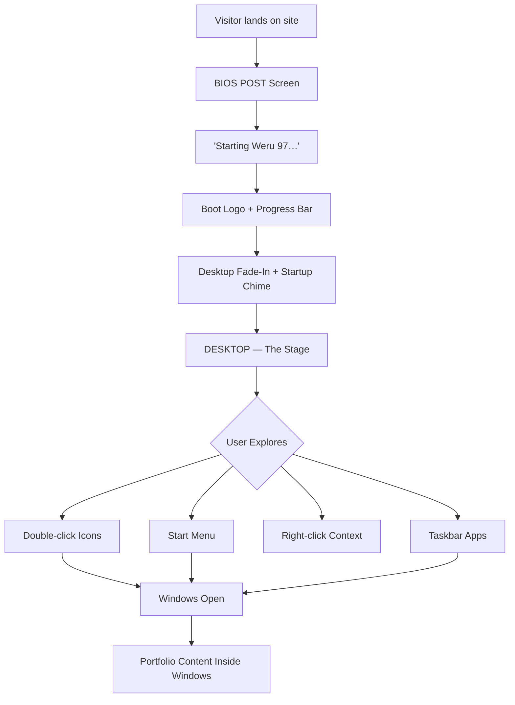
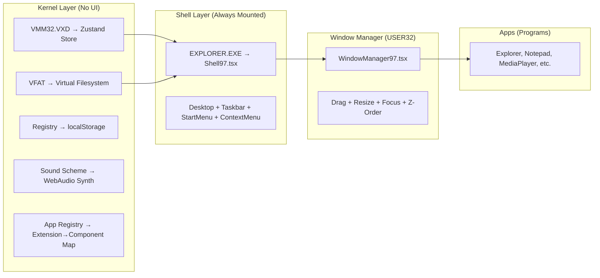

# Weru 97 — Complete Architecture, Flow & Functionality Blueprint

> **This is NOT a code plan yet.** This is the creative and technical brain behind Weru 97 — every flow, every click, every sound, every easter egg. You (Roy) handle the UI/UX design on Stitch. I handle the logic, the architecture, and the soul.

---

## 1. The Big Picture: What Is Weru 97?

Weru 97 is your portfolio disguised as a fully functional 1997 desktop operating system. It's not "retro-themed" — it **is** the OS. Visitors don't browse your portfolio; they **use your computer**. Every project is a file. Every skill is system hardware. Every interaction follows the rules of Windows 95 OSR 2.5 (the real "Windows 97").



---

## 2. Current State vs. Target State

### What exists now (Windows 11 Fluent — already migrated FROM macOS)

The codebase has **already completed** a migration from macOS to Windows 11. The active runtime is fully Windows 11 Fluent:

| Layer | Current (Win11) | What Needs to Change for Win97 |
|-------|-----------------|-------------------------------|
| **Shell** | Centered bottom taskbar (`Taskbar.tsx`), Windows 11 Start Menu (`StartMenu.tsx`), Quick Settings flyout (`QuickSettings.tsx`) | → Left-aligned Start button, classic cascading Start Menu, no Quick Settings |
| **Window Chrome** | Rounded 6px corners, Fluent `×`/`−`/`□` controls, acrylic materials, 8-zone Aero Snap (`snap-engine.ts`) | → Square corners, 2px bevels, `[_][□][X]` buttons, blue gradient title bar, no snap layouts |
| **Boot** | Windows 11 staged: lock screen (4-square logo + clock) → user card → spinning ring "Welcome" | → BIOS POST → "Starting Weru 97…" → clouds logo → desktop |
| **Desktop** | Draggable shortcuts on Bloom-gradient wallpaper, Win11 context menu (New Folder, Rename, Delete, Properties) | → Bliss wallpaper, left-column icons, Win95 context menu, CRT scanlines |
| **Context Menu** | White `#ffffff`, 4px radius, blue hover `#e5f1fb` — BUT `constants/index.ts` still has macOS items: "Use Stacks", "Import from iPhone…" | → Gray `#C0C0C0`, 0px radius, navy `#000080` hover, era-correct items |
| **Typography** | `Segoe UI Variable` / `Segoe UI`, neutral surfaces, `#0067c0` accent | → Tahoma 8px for UI, Courier New for Notepad, VT323 for terminal |
| **Filesystem** | `C:\Users\Admin\Desktop\...` via **Dexie IndexedDB** (`filesystem-db.ts`). Full CRUD, recycle bin, search, system protections | → Flatten to `C:\My Documents`, `C:\Projects`, `C:\Recycled`. Keep IndexedDB engine |
| **State** | Zustand `os-store.ts` persisted to localStorage. Manages windows, z-order, focus, desktops, settings | → Same engine, retune for Win95 modes (no "snapped"), remove virtual desktops, simplify settings |
| **Apps** | Explorer, Notepad, Media Player, Terminal (tabbed!), Settings, Recycle Bin, Projects gallery, About, Contact/Mail, Photos | → Restyle as Win95 apps. Add: Calculator, Minesweeper, CD Player, Paint, IE4, MS-DOS Prompt, Control Panel |

### Dormant macOS Remnants (to be deleted)
These files are **orphaned** — they were part of the macOS era and are no longer rendered:
- [Dock.tsx](file:///c:/Users/Admin/OneDrive/Desktop/weru_os/src/components/Dock.tsx) + [dock.css](file:///c:/Users/Admin/OneDrive/Desktop/weru_os/src/styles/dock.css) — complete macOS Dock with spring magnification
- [MenuBar.tsx](file:///c:/Users/Admin/OneDrive/Desktop/weru_os/src/components/MenuBar.tsx) + [menubar.css](file:///c:/Users/Admin/OneDrive/Desktop/weru_os/src/styles/menubar.css) — macOS top menu bar with ⌘-key shortcuts
- [Spotlight/](file:///c:/Users/Admin/OneDrive/Desktop/weru_os/src/components/Spotlight) + [useSpotlight.ts](file:///c:/Users/Admin/OneDrive/Desktop/weru_os/src/hooks/useSpotlight.ts) — named after macOS Spotlight
- [Sidebar/index.tsx](file:///c:/Users/Admin/OneDrive/Desktop/weru_os/src/components/Sidebar) — macOS Finder sidebar (`.finder-sidebar` class)
- [useParallax.ts](file:///c:/Users/Admin/OneDrive/Desktop/weru_os/src/hooks/useParallax.ts) — parallax wallpaper motion (too modern for Win95)
- Legacy macOS strings in [constants/index.ts](file:///c:/Users/Admin/OneDrive/Desktop/weru_os/src/constants/index.ts): `'apple-about'`, `'apple-system-preferences'`, `'Use Stacks'`, `'Import from iPhone…'`
- [template.txt](file:///c:/Users/Admin/OneDrive/Desktop/weru_os/template.txt) — original "Misty Topography" macOS design spec
- [context.txt](file:///c:/Users/Admin/OneDrive/Desktop/weru_os/context.txt) — 78KB dark-mode cyberpunk prototype with macOS traffic lights

### What to KEEP from the current codebase (adapt, don't rewrite)
These are well-engineered and should be **restyled and tuned**, not thrown away:

1. **Zustand [os-store.ts](file:///c:/Users/Admin/OneDrive/Desktop/weru_os/src/features/os/os-store.ts)** — window management, z-order, focus, persistence. Simplify for Win95 (remove snap slots, virtual desktops).
2. **Dexie IndexedDB VFS** — [filesystem-service.ts](file:///c:/Users/Admin/OneDrive/Desktop/weru_os/src/features/filesystem/filesystem-service.ts), [filesystem-db.ts](file:///c:/Users/Admin/OneDrive/Desktop/weru_os/src/features/filesystem/filesystem-db.ts). Re-seed with Win95 directory tree (`C:\My Documents`, `C:\Projects`, etc.).
3. **[open-target.ts](file:///c:/Users/Admin/OneDrive/Desktop/weru_os/src/features/os/open-target.ts)** — polymorphic file → app routing. Add Win95 extensions (`.avi`, `.bmp`, `.spec`).
4. **[app-registry.ts](file:///c:/Users/Admin/OneDrive/Desktop/weru_os/src/features/apps/app-registry.ts)** — app definitions. Expand with Calculator, Minesweeper, CD Player, Paint, IE4, etc.
5. **Terminal commands** — [terminal-commands.ts](file:///c:/Users/Admin/OneDrive/Desktop/weru_os/src/features/terminal/terminal-commands.ts) already has `matrix`, `whoami`, `fortune`, `neofetch`. Restyle as MS-DOS Prompt.
6. **Window drag/resize logic** — pointer-capture based in [Window.tsx](file:///c:/Users/Admin/OneDrive/Desktop/weru_os/src/components/Window.tsx). Strip Aero Snap, restyle chrome.
7. **[ExplorerContent.tsx](file:///c:/Users/Admin/OneDrive/Desktop/weru_os/src/windows/ExplorerContent.tsx)** — dual-pane explorer with address bar, tree, CRUD, keyboard shortcuts. Restyle as Win95 Explorer.
8. **[NotepadContent.tsx](file:///c:/Users/Admin/OneDrive/Desktop/weru_os/src/windows/NotepadContent.tsx)** — file read/write with dirty state, Ctrl+S, save-as. Restyle as Win95 Notepad.
9. **[RecycleBinContent.tsx](file:///c:/Users/Admin/OneDrive/Desktop/weru_os/src/windows/RecycleBinContent.tsx)** — trash list with restore/empty via Dexie. Restyle.
10. **Profile isolation** — [profile-storage.ts](file:///c:/Users/Admin/OneDrive/Desktop/weru_os/src/features/os/profile-storage.ts) namespaces all storage per browser instance. Keep as-is.

### What we're building (Weru 97)
| Layer | Target |
|-------|--------|
| **Shell** | One persistent `<Shell97/>`: desktop + taskbar (bottom) + start menu |
| **Window Chrome** | Flat gray `#C0C0C0`, 2px bevels, blue gradient title bar `#000080→#1084D0`, square corners |
| **Boot** | BIOS POST → "Starting Weru 97…" → clouds logo → desktop |
| **Desktop** | Bliss wallpaper, left-column icons, CRT scanlines |
| **Taskbar** | Start button (left) + quick launch + task buttons + system tray + clock |
| **Context Menu** | "Arrange Icons ▸", "Refresh", "Paste", "Properties" |
| **Typography** | Tahoma 8px for UI, Courier New for Notepad, VT323 for terminal |
| **Filesystem** | `C:\My Documents`, `C:\Projects`, `C:\Recycled` (flattened from `C:\Users\Admin\...`) |

> [!IMPORTANT]
> **The core insight from the build prompts:** Explorer.exe in Win95 = ONE program that owns the desktop, taskbar, start menu, AND every folder window. Our `<Shell97/>` must feel like one living organism. This is NOT separate components bolted together.

---

## 3. Architecture: The OS as a Web App

### 3.1 Layer Map (Real Win95 → Web Equivalent)



### 3.2 Recommended File Structure

```
src/
├── os/                          ← the "kernel + drivers" (no UI)
│   ├── kernel/
│   │   ├── store.ts             ← zustand: windows, focus, zOrder, processes
│   │   ├── actions.ts           ← openWindow, closeWindow, focusWindow, minimize
│   │   └── types.ts             ← Weru97Window, AppId, ProcessState
│   ├── fs/
│   │   ├── filesystem.ts        ← virtual FAT: the C:\ tree
│   │   ├── paths.ts             ← resolve("C:\\Projects\\3D-Website")
│   │   └── content/             ← your real data
│   │       ├── projects/        ← one ts file per project
│   │       ├── documents/       ← about_me.txt, cv, skills.txt
│   │       └── media/           ← video/audio manifests
│   ├── registry/
│   │   └── settings.ts          ← wallpaper, sound, positions (localStorage)
│   ├── sound/
│   │   └── synth.ts             ← WebAudio: startup, click, error, open
│   └── apps/
│       └── registry.ts          ← .txt→Notepad, .avi→MediaPlayer, .bmp→Paint
│
├── shell/                       ← EXPLORER.EXE — never unmounts
│   ├── Shell97.tsx              ← desktop + taskbar + start menu root
│   ├── Desktop97.tsx            ← icons, wallpaper, drag-select, context menu
│   ├── Taskbar97.tsx            ← start button, task buttons, tray + clock
│   ├── StartMenu97.tsx          ← Programs ▸ cascade, Documents ▸, Shut Down…
│   └── ContextMenu97.tsx        ← right-click menus (desktop, files, taskbar)
│
├── wm/                          ← the window manager (USER32)
│   ├── Window97.tsx             ← chrome: titlebar, menu, bevels, status bar
│   ├── WindowManager97.tsx      ← renders open windows, z-order, drag/resize
│   ├── useDrag97.ts
│   └── useResize97.ts
│
├── components/                  ← COMCTL32 (the reusable Win95 UI kit)
│   ├── Button95.tsx
│   ├── TitleBar95.tsx
│   ├── MenuBar95.tsx
│   ├── Dialog95.tsx
│   ├── Scrollbar95.tsx
│   ├── Icon32.tsx
│   ├── TaskbarButton.tsx
│   ├── Toolbar95.tsx
│   ├── Clock95.tsx
│   └── Tray95.tsx
│
├── apps/                        ← the accessory programs
│   ├── explorer/Explorer97.tsx  ← folder windows + tree + list + address bar
│   ├── notepad/Notepad97.tsx
│   ├── mediaPlayer/MediaPlayer97.tsx
│   ├── cdPlayer/CdPlayer97.tsx
│   ├── paint/Paint97.tsx
│   ├── calc/Calculator97.tsx
│   ├── ie4/RetroBrowser97.tsx
│   ├── msDosPrompt/MsDosPrompt97.tsx
│   ├── games/
│   │   ├── minesweeper/Minesweeper97.tsx
│   │   └── solitaire/Solitaire97.tsx
│   └── system/
│       ├── SystemProperties97.tsx  ← "About Me" as System Properties
│       ├── ControlPanel97.tsx
│       └── ShutDown97.tsx
│
├── boot/
│   └── BootSequence97.tsx       ← BIOS → Starting → Logo → Desktop
│
├── assets/
│   ├── icons/                   ← 32px pixel icons
│   ├── cursors/                 ← arrow, hourglass, hand, text beam
│   ├── wallpaper/               ← bliss.png + alternates
│   └── sounds/                  ← (or synthesize in sound/synth.ts)
│
├── styles/
│   ├── tokens97.css             ← Win95 palette as CSS variables
│   ├── bevels.css               ← .raised / .sunken / .window-frame
│   ├── fonts97.css              ← Tahoma, Courier New, VT323
│   └── crt.css                  ← scanlines overlay
│
└── App.tsx                      ← BootSequence → Shell97
```

---

## 4. The Boot Sequence — First Impressions

This is the **emotional arc**. It takes a visitor from "oh, a website" to "wait... this IS a computer."

### Scene 1 — BIOS POST (2 seconds)
```
Black screen. Gray monospace text, top-left:

Phoenix BIOS v4.06 R2.P21, An Energy Star Ally
Copyright 1985-1997 Phoenix Technologies Ltd.

Pentium II Processor 233 MHz
Memory Test: 65536K OK

Detecting IDE drives...
  Primary Master:   WERU-PORTFOLIO HDD
  Primary Slave:    None
  Secondary Master: WERU CD-ROM 52X
  Secondary Slave:  None

Verifying DMI Pool Data.............
```

**Flow logic:** Text appears line by line with typewriter timing (80ms per line). Memory count rolls up from 0K to 65536K.

### Scene 2 — "Starting Weru 97…" (1.5 seconds)
```
Black screen. White Tahoma text centered near bottom:

Starting Weru 97…
```

**Flow logic:** Fade in from black. Static hold.

### Scene 3 — Boot Logo (2.5 seconds)
```
Blue sky with white clouds background.
Weru 97 logo (4-color waving flag style) centered.
Text: "Weru 97" below the flag.
Segmented blue progress bar underneath, filling left to right.
```

**Flow logic:** Progress bar uses 10 segments, filling one at a time (250ms each). This is where we preload assets (icons, wallpaper, sounds).

### Scene 4 — Desktop Fade-In (1.5 seconds)
```
Boot logo fades down to reveal:
- Bliss wallpaper fades in first
- Taskbar slides up from bottom (200ms)
- Desktop icons pop in left-to-right (staggered 100ms each)
- Startup chime plays (The Microsoft Sound equivalent)
```

**Flow logic:** Phase transitions from `'boot'` → `'bios'` → `'starting'` → `'logo'` → `'desktop'`. A "Skip >>" text in bottom-right lets impatient visitors jump straight to desktop.

> [!TIP]
> **Asset preloading during boot**: While the progress bar fills, lazy-load all app components, icons, and the wallpaper. The boot isn't just theater — it's a loading strategy.

---

## 5. The Desktop — Home Page

### 5.1 Wallpaper
The classic "Bliss" — vivid green rolling hill (bottom 40%), blue sky with soft white cumulus clouds. Slight pixelation applied via CSS `image-rendering: pixelated` at lower resolution. A CRT scanline overlay at 3% opacity across the whole viewport.

### 5.2 Desktop Icons (Left Column)
Single vertical column, top-left aligned. 32px pixel art icons with 8px white Tahoma labels (1px black text-shadow for contrast):

| # | Icon | Label | Double-Click Action |
|---|------|-------|---------------------|
| 1 | CRT monitor | **My Computer** | Opens Explorer at `C:\` showing drives |
| 2 | Yellow folder | **My Documents** | Opens Explorer at `C:\My Documents` |
| 3 | Open yellow folder | **Projects** | Opens Explorer at `C:\Projects` |
| 4 | Folder + filmstrip | **Videos** | Opens Explorer at `C:\My Documents\Videos` |
| 5 | Folder + music note | **My Music** | Opens CD Player |
| 6 | Folder + image | **My Pictures** | Opens Paint/Image viewer |
| 7 | Blue "e" orbit | **Internet Explorer** | Opens Retro Browser (links page) |
| 8 | Folder + joystick | **Games** | Opens Explorer at `C:\Program Files\Games` |
| 9 | *(gap)* | | |
| 10 | Recycle bin | **Recycle Bin** | Opens Recycle Bin |

### 5.3 Icon Interaction States
- **Hover**: Icon brightens slightly (filter: brightness(1.1))
- **Single click**: Label gets dotted focus rectangle with dark navy (#000080) fill, white text
- **Double click**: Window opens with a subtle pop-open animation
- **Drag**: Icons can be dragged to new positions (grid-snapped)
- **Rubber-band select**: Click-drag on desktop draws a dotted selection rectangle

### 5.4 The Taskbar
Pinned to bottom, full viewport width, ~30px tall, `#C0C0C0` background with raised 2px bevel at top.

```
[🪟 Start] | [📂][📝][▶][🌐] | [My Documents] [Notepad] | [🔊 📺 8:52 PM]
 ↑ Start     ↑ Quick Launch      ↑ Task Buttons              ↑ System Tray
```

#### Start Button
- Raised gray bevel, 4-color Weru flag icon + bold "**Start**" in Tahoma 11px
- Pressed state: sunken bevel, shifts down-right 1px
- Clicking opens the Start Menu (see §6)

#### Quick Launch (4 mini icons)
- Explorer, Notepad, Media Player, Internet Explorer
- Separated from Start button by thin vertical divider line
- Single click opens the app

#### Task Buttons (center area)
- One button per open window
- Active/focused window: button appears pressed/sunken
- Inactive windows: button appears raised
- Clicking a taskbar button: focuses that window (if another is focused), minimizes it (if it's already focused)
- Text truncated with ellipsis at ~120px width

#### System Tray (right side)
- Recessed sunken panel containing:
  - Speaker icon (click toggles sounds on/off)
  - Small monitor icon (hover shows "Resolution: 1024×768")
  - Digital clock in Tahoma 8px: "8:52 PM" (real local time)
  - Click clock → tiny calendar popup

---

## 6. The Start Menu — Navigation Hub

Classic Windows 95 two-column cascading menu, anchored bottom-left above the Start button.

### Structure
```
┌──────────────────────────────┐
│ ██ W │ Programs          ▸  │ ← cascade opens submenu
│ ██ e │ Documents         ▸  │
│ ██ r │ Settings          ▸  │
│ ██ u │ Find              ▸  │
│ ██   │ Help                 │
│ ██ 9 │ Run…                 │
│ ██ 7 │─────────────────────│
│      │ Shut Down…           │
└──────────────────────────────┘
```

### Cascading Submenus

#### Programs ▸
```
├── Windows Explorer
├── Notepad
├── WordPad
├── Microsoft Paint
├── Media Player
├── CD Player
├── Calculator
├── Internet Explorer
├── MS-DOS Prompt
├── ─────────────
└── Games ▸
    ├── Minesweeper
    ├── Solitaire
    └── FreeCell
```

#### Documents ▸
```
├── about_me.txt         → opens in Notepad
├── cv.pdf               → opens in IE (or PDF viewer style)
├── skills.txt           → opens in Notepad
├── experience.txt       → opens in Notepad
└── project-demo.avi     → opens in Media Player
```

#### Settings ▸
```
├── Control Panel        → opens Control Panel window
└── Taskbar              → opens Taskbar settings dialog
```

#### Find ▸
```
└── Files or Folders…    → opens a Find dialog (searches the VFS)
```

### Shut Down…
Opens the classic Shut Down dialog (see §12.2).

### Interaction Rules
- Hover: Classic inverted navy (#000080) highlight bar
- Submenus cascade to the right (or left if near screen edge)
- Clicking outside the menu closes it
- Menu has 2px raised border, white inner edge
- Disabled items in grayed text (#808080), no hover effect

---

## 7. The Window Manager — The Heart

### 7.1 Window Chrome (Every Window)

```
┌─[ icon ] Window Title                    [_][□][X]─┐
├─ File  Edit  View  Help ──────────────────────────┤
│                                                     │
│              [App Content Area]                      │
│                                                     │
├─────────────────────────────────────────────────────┤
│  Status: 5 object(s)                                │
└─────────────────────────────────────────────────────┘
```

- **Title bar**: Blue gradient `#000080 → #1084D0` when active, gray `#808080` when inactive
- **Title bar buttons**: `[_]` minimize, `[□]` maximize/restore, `[X]` close — all 16px square with bevels
- **Menu bar**: Gray #C0C0C0, raised items on hover
- **Bevel recipe**: Outer 1px `#DFDFDF` → 1px `#808080`, inner `#FFFFFF` / `#404040`
- **Status bar**: Sunken panel at bottom, left-aligned text
- **Resize handles**: 4px invisible borders on all edges + corners
- **Square corners always** — zero border-radius

### 7.2 Window Behaviors

| Action | Behavior |
|--------|----------|
| **Click title bar** | Focus window, bring to top of z-order |
| **Drag title bar** | Move window freely (constrain to viewport) |
| **Double-click title bar** | Toggle maximize/restore |
| **Click [_]** | Minimize to taskbar (window disappears, taskbar button stays) |
| **Click [□]** | Maximize (fill desktop, not taskbar area) / restore |
| **Click [X]** | Close window (remove from taskbar) |
| **Click anywhere in window** | Focus it (bring to top) |
| **Resize from edges** | Free resize (minimum size per app) |
| **Right-click title bar** | Title bar context menu: Restore, Move, Size, Minimize, Maximize, Close |
| **Right-click taskbar** | Cascade Windows, Tile Horizontally, Tile Vertically, Minimize All |

### 7.3 Z-Order Rules
1. Focused window is always top of z-order
2. When focused window is closed, focus goes to next-highest in z-order
3. When minimized, window leaves z-order stack
4. When restored, window goes to top of z-order
5. Dialogs (modal) go above all windows and block interaction behind them

---

## 8. The Virtual Filesystem — Everything Is a File

### 8.1 Directory Tree
```
C:\
├── My Documents\
│   ├── about_me.txt           ← opens in Notepad: personal bio
│   ├── cv.pdf                 ← opens in RetroViewer: resume
│   ├── skills.txt             ← opens in Notepad: skill list
│   ├── experience.txt         ← opens in Notepad: work history
│   └── Videos\
│       ├── demo-reel.avi      ← opens in Media Player
│       └── project-walkthrough.avi
│
├── Projects\                   ← THE portfolio core
│   ├── 3D-Website\
│   │   ├── README.txt         ← project description
│   │   ├── demo.avi           ← video demo
│   │   ├── screenshots.bmp    ← opens in Paint
│   │   ├── case-study.url     ← opens in IE (link to live site)
│   │   └── tech-stack.spec    ← opens System Properties-style dialog
│   │
│   ├── AI-Chatbot\
│   │   ├── README.txt
│   │   ├── demo.avi
│   │   ├── screenshots.bmp
│   │   ├── case-study.url
│   │   └── tech-stack.spec
│   │
│   ├── Brand-Identity\
│   │   └── (same structure)
│   │
│   ├── Mobile-App\
│   │   └── (same structure)
│   │
│   └── E-Commerce-Store\
│       └── (same structure)
│
├── Program Files\
│   ├── Accessories\
│   │   ├── notepad.exe
│   │   ├── calc.exe
│   │   ├── mplayer.exe
│   │   └── pbrush.exe
│   ├── Internet Explorer\
│   │   └── iexplore.exe
│   └── Games\
│       ├── winmine.exe
│       └── sol.exe
│
├── Windows\
│   ├── System\
│   │   └── secrets.txt        ← EASTER EGG
│   ├── Media\
│   │   ├── tada.wav
│   │   ├── chord.wav
│   │   ├── ding.wav
│   │   └── The Weru Sound.wav
│   └── Start Menu\
│       └── Programs\          ← mirrors Start > Programs
│
├── Recycled\                   ← Recycle Bin
│
├── IO.SYS                     ← hidden system file (flavor)
├── MSDOS.SYS                  ← hidden system file (flavor)
└── COMMAND.COM                ← hidden system file (flavor)
```

### 8.2 File Extension → App Mapping

| Extension | App | Icon |
|-----------|-----|------|
| `.txt` | Notepad97 | 📝 Text file |
| `.avi` / `.mov` | MediaPlayer97 | 🎬 Video clip |
| `.wav` / `.mid` | CdPlayer97 | 🎵 Audio file |
| `.bmp` / `.jpg` / `.png` | Paint97 (viewer mode) | 🖼️ Bitmap image |
| `.url` | RetroBrowser97 | 🌐 Internet shortcut |
| `.spec` | SystemProperties97 (tech stack) | 📋 Spec sheet |
| `.exe` | Launches the app | ⚙️ Application |
| `.lnk` | Resolves shortcut → target app | 🔗 Shortcut |

### 8.3 File Interaction Rules
- **Single click**: Selects file (highlight row in details view, dotted rect on icon)
- **Double click**: Opens file with associated app
- **Right-click**: Context menu → Open, Open With…, Cut, Copy, Delete, Rename, Properties
- **Drag**: Move between folders (not implemented in v1, show "not supported" cursor)
- **Properties dialog**: Shows Name, Type, Size, Created, Modified — styled as tabbed dialog

---

## 9. App Specifications — What Each App Does

### 9.1 File Explorer (explorer.exe)
**The most important app.** This is how visitors navigate the portfolio.

**Window layout:**
- Menu bar: File | Edit | View | Help
- Toolbar: Back, Forward, Up | Cut, Copy, Paste | Views toggle
- Address bar: Sunken white field showing path (e.g., "C:\Projects")
- Left pane: Folder tree with +/- expand/collapse boxes
- Right pane: Details view with sortable columns (Name | Size | Type | Date Modified)
- Status bar: "5 object(s)"

**Behaviors:**
- Clicking a folder in the tree updates the right pane
- Double-clicking a folder in the right pane navigates into it (address bar updates)
- Double-clicking a file opens it with the associated app
- Back/Forward buttons navigate history
- Up button goes to parent folder
- Views toggle switches between Icons/List/Details

### 9.2 Notepad (notepad.exe)
**The text reader for portfolio content.**

- Menu bar: File | Edit | Search | Help
- No toolbar (authentic — real Notepad had no toolbar)
- White text area, Courier New 10px, word-wrap on
- Content is the actual portfolio text (about me, skills, README files)
- Blinking text caret for immersion
- Edit menu: Select All, Copy work. Others disabled.
- File > Exit closes the window

### 9.3 Media Player (mplayer.exe)
**The video showcase — styled as Windows Media Player 6.4.**

- Video display area (4:3, dark background with scanlines)
- Transport controls: Play, Stop, Pause (round beveled buttons)
- Slider: White sunken track, gray handle, LCD time display "00:24 / 00:45"
- Right side: Playlist pane listing project demo videos
- Volume mini-slider with speaker icon
- **Compact mode**: Tiny floating window with LCD time + play/stop

**What plays:** Embedded project demo videos (YouTube embeds in a retro frame, or short webm loops).

### 9.4 CD Player (cdplayer.exe)
**The music/audio experience.**

- Compact window with LCD display (dark recessed, seven-segment digits)
- Track time, Artist name, Track title
- Transport: |◀ ▶ ■ ❚❚ ▶| ⏏
- Playlist dropdown: portfolio ambient tracks
- **Now Playing mini-window**: Animated equalizer (7 green bars) + scrolling track name
- Plays synthesized ambient music or curated lo-fi tracks

### 9.5 Internet Explorer 4 (iexplore.exe)
**The retro browser — opens .url files.**

- Full IE4 chrome: Back, Forward, Home, Search, Favorites toolbar
- Address bar shows the URL from the .url file
- Content area renders a 1997-style personal homepage:
  - "My Links" heading in Times New Roman
  - Horizontal rule
  - Link list: Email, GitHub, LinkedIn, Twitter/X — underlined blue hyperlinks
  - Visitor counter: "You are visitor number 0001337"
  - "Best viewed at 800×600" badge
- Status bar: "Done"
- **Used for**: Contact/links page + opening case study URLs

### 9.6 Paint (pbrush.exe)
**The image viewer for screenshots.**

- Left: Vertical toolbox (pencil tool pressed)
- Bottom: 28-color palette grid
- Center: Canvas showing project screenshots with scrollbars
- Read-only in v1 — tools are visual props
- Opens `.bmp` and `.jpg` files

### 9.7 Calculator (calc.exe)
**Actually functional — proves attention to detail.**

- Standard calculator layout (authentic Win95 key grid)
- LCD display, right-aligned
- All math operations work: +, -, ×, ÷, %, √, 1/x
- Memory operations: MC, MR, MS, M+
- Small fixed-size window (non-resizable)

### 9.8 Minesweeper (winmine.exe)
**The "wow, they actually built this" moment.**

- Beginner 9×9 grid
- Smiley face reset button (😊 → 😎 on win, 😵 on lose)
- LED mine counter (left) + timer (right)
- Flags, reveals, cascading empty reveals
- Classic number colors: 1=blue, 2=green, 3=red, 4=dark blue

### 9.9 MS-DOS Prompt
**The power-user portal — replaces the current Terminal.**

- Black background, white/green monospace text
- Custom command set:

```
C:\> help

Available commands:
  dir              List directory contents
  cd <path>        Change directory
  type <file>      Display file contents
  cls              Clear screen
  ver              Display Weru 97 version
  projects         List all portfolio projects
  skills           Display skill matrix
  contact          Open contact form
  whoami           About Roy Weru
  matrix           Easter egg 🐰
  tree             Show directory tree
  echo <text>      Print text
  exit             Close MS-DOS Prompt
```

### 9.10 System Properties (About Me)
**Your bio disguised as system information.**

- Title: "System Properties" — tabbed dialog (General | Hardware | Performance)
- **General tab**:
  - Left: 48px retro computer icon (CRT + tower)
  - Right: "System: Weru 97 / Portfolio Machine / Registered to: Roy Weru Matheri"
  - "Computer: Pentium II 233 MHz, 64.0 MB RAM"
- **Hardware tab**: Skills as "devices" — React.js Driver, Python Engine, Docker Container
- **Performance tab**: Two progress bars — "Graphics: 87%" / "Hard Disk: 92%" — animated fills

### 9.11 Control Panel
**Settings hub — styled as icon grid.**

- Display Properties: Change wallpaper, screen saver
- Sounds: Toggle sound scheme on/off
- System: Opens System Properties

### 9.12 Shut Down Dialog
**The farewell.**

- "What do you want the computer to do?"
- Radio options: Shut down / Restart / Close all programs
- **Shut down**: Screen fades to black → "It's now safe to turn off your computer" (orange text on black) → reset button returns to boot
- **Restart**: Full page reload with boot sequence
- Cancel: Returns to desktop

---

## 10. Context Menus — Right-Click Everywhere

### 10.1 Desktop Right-Click
```
Arrange Icons ▸   (by Name | by Type | Auto Arrange)
Line Up Icons
─────────────
Paste
Paste Shortcut    (grayed out)
─────────────
New ▸             (Folder | Text Document | Shortcut)
─────────────
Properties        (opens Display Properties)
```

### 10.2 File Right-Click (in Explorer)
```
Open
Open With… ▸
─────────────
Cut
Copy
─────────────
Delete
Rename
─────────────
Properties
```

### 10.3 Taskbar Right-Click
```
Cascade Windows
Tile Windows Horizontally
Tile Windows Vertically
─────────────
Minimize All Windows
─────────────
Properties
```

---

## 11. Sound Scheme — The Cheapest Authenticity Multiplier

All sounds are synthesized via WebAudio API (tiny, no network cost):

| Event | Sound | Notes |
|-------|-------|-------|
| Boot complete | Startup chime | Brian Eno-inspired 6-second chord |
| Window open | Chord | Major chord, 200ms |
| Window close | Soft click | Short click, 50ms |
| Error dialog | Ding | Sharp alert, 300ms |
| Button click | Tick | Subtle mechanical click, 30ms |
| Start menu open | Menu pop | Light pop, 80ms |
| Empty recycle bin | Crunch | Paper crush, 400ms |
| Shut down | Shutdown chord | Descending chord |

Sounds are **mutable** via Control Panel > Sounds or system tray speaker icon.

---

## 12. Dialogs — The Personality Layer

### 12.1 First-Time Visitor Warning
Appears the FIRST time someone opens Projects:
```
┌─ System Warning ──────────────────────┐
│  ⚠️  Are you sure you want to         │
│      explore amazing work?            │
│                                       │
│              [Yes]  [Cancel]          │
└───────────────────────────────────────┘
```

### 12.2 Shut Down Dialog
See §9.12 above.

### 12.3 "About Weru 97" Dialog
```
┌─ About Weru 97 ──────────────────────┐
│                                       │
│  🪟  Weru 97                          │
│     Version 4.00.950B                 │
│     Copyright © 1997 Roy Weru         │
│                                       │
│     This product is licensed to:      │
│     You, the visitor                  │
│                                       │
│              [OK]                     │
└───────────────────────────────────────┘
```

### 12.4 Recycle Bin Empty Confirmation
```
┌─ Confirm ─────────────────────────────┐
│  🗑️  Are you sure you want to delete  │
│     all items in the Recycle Bin?      │
│                                       │
│              [Yes]  [No]              │
└───────────────────────────────────────┘
```

---

## 13. Easter Eggs — Reward Exploration

| Trigger | Easter Egg |
|---------|------------|
| Type `matrix` in MS-DOS Prompt | Green Matrix code rain fills the terminal |
| Navigate to `C:\Windows\System\secrets.txt` | Hidden message: "You found it. The real treasure was the journey." |
| Click the clock 7 times rapidly | Screen goes into "Y2K panic" mode briefly — flickering numbers |
| Visit at midnight (local time) | Wallpaper switches to a starry night sky variant |
| Type `IDDQD` in any text field | Minesweeper board reveals all mines (God mode) |
| Right-click Recycle Bin 5 times | Clippy appears briefly: "It looks like you're trying to delete something!" |
| Open Calculator, type `58008` upside down | Display flips upside down momentarily |
| Find > type "Roy" | Shows all files with a winking emoji |

---

## 14. Responsive Strategy

> Real Windows 95 wasn't responsive — but your portfolio must be accessible.

| Viewport | Behavior |
|----------|----------|
| **Desktop (≥1024px)** | Full experience: 1024×768 logical canvas, all apps |
| **Tablet (768-1023px)** | Scaled-down desktop, windows auto-fit, no resize handles |
| **Mobile (<768px)** | "Mobile mode": simplified Start menu as full-screen list, single window at a time, taskbar simplified to icons only, "This experience is best on desktop" banner on first load |

---

## 15. Keyboard Shortcuts

| Shortcut | Action |
|----------|--------|
| `Ctrl+Esc` | Toggle Start Menu |
| `Alt+F4` | Close focused window |
| `Alt+Tab` | Window switcher (show live previews) |
| `F5` | Refresh desktop |
| `Win+E` / `Ctrl+E` | Open Explorer |
| `Win+R` / `Ctrl+R` | Run dialog |
| `Win+D` / `Ctrl+D` | Minimize all / Show desktop |

---

## 16. State Persistence (The "Registry")

Using localStorage as the Windows Registry:

| Key | What It Stores |
|-----|----------------|
| `weru97-wallpaper` | Current wallpaper ID |
| `weru97-sounds` | Sound scheme on/off |
| `weru97-window-positions` | Last position/size of each window |
| `weru97-icon-positions` | Desktop icon positions |
| `weru97-visited` | First visit flag (for showing welcome dialog) |
| `weru97-recycle` | Recycle bin contents |
| `weru97-theme` | Color scheme settings |

---

## 17. Performance Guardrails

1. **Max 8 open windows** — auto-minimize oldest when limit reached
2. **Lazy load all apps** — only mount when first opened
3. **CSS transforms for animations** — never animate layout properties
4. **Virtual scrolling** in Explorer for folders with many items
5. **Debounce resize/drag events** at 16ms (60fps)
6. **Asset preloading during boot** — wallpaper, icons, fonts load during progress bar
7. **Sound synthesis** — no audio file network requests

---

## Open Questions for Roy

> [!IMPORTANT]
> These decisions affect the architecture. Let me know your preferences:

1. **Your real projects**: How many projects should appear in `C:\Projects`? What are their names, tech stacks, and live URLs? I'll need this to build the filesystem content.

2. **Videos**: Do you have actual project demo videos (YouTube/webm), or should the Media Player show placeholder content?

3. **Music**: Should CD Player play actual audio (lo-fi background tracks), or just simulate playback visually?

4. **Solitaire**: Full card game implementation or just the visual + a few moves?

5. **Contact form**: Should the Mail/IE contact form actually send emails (via Formspree/EmailJS), or just simulate?

6. **Domain**: Will this deploy to a custom domain? Affects "About Weru 97" dialog and visitor counter.

7. **Mobile**: Simplified "Windows Phone 97" easter egg, or just a "best on desktop" message?

8. **Profile content**: I see you're Roy Weru Matheri, based in Nairobi, with experience in AI/agents + full-stack. Should the "About Me" system properties reflect this exactly, or do you want to customize?

---

## Verification Plan

### Automated Tests
- Virtual filesystem path resolution
- Window manager z-order logic  
- File extension → app mapping
- Calculator math operations
- Minesweeper game logic

### Manual Verification
- Boot sequence timing and transitions
- Window drag/resize/minimize/maximize/close
- Start menu cascade behavior
- Context menu positioning (screen edge awareness)
- Sound playback and muting
- Responsive breakpoints
- All file double-click → correct app opens
- Easter egg triggers
